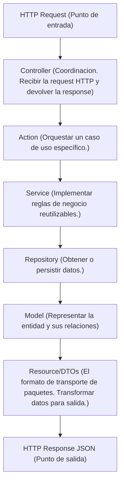
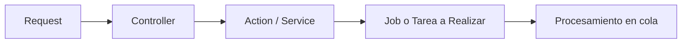

# PROYECTO: LARAVEL 12 REST TEMPLATE

Proyecto básico de Laravel 12 para usar como template de API REST de otros proyectos. Con una estructura base y arquitectura definida.

Este proyecto utiliza una arquitectura basada en separación de responsabilidades (Separation of Concerns) para mantener el código organizado, escalable y fácil de mantener.

Al tratarse de una API REST, no existe capa de presentación basada en vistas ni renderizado del lado del servidor. Toda la aplicación está orientada a la exposición de servicios mediante endpoints HTTP.

## STACK

- PHP 8.3
- Laravel 12
- MariaDB 10.3 / MySQL

## ARQUITECTURA

- `/Actions`: Representa una operación concreta del dominio y suele coordinar múltiples servicios, repositorios o procesos necesarios para completar una tarea
- `/DTOs`: Objetos para transportar datos entre capas de la aplicación. Proporcionan estructuras tipadas y explícitas para el intercambio de información.
- `/Enums`: Definen conjuntos de valores constantes relacionados con el dominio. Ayudan a evitar el uso de strings o números mágicos distribuidos por el código.
- `/Exceptions`: Excepciones personalizadas. Permiten representar errores específicos del dominio y centralizar el manejo de errores.
- `/Helpers`: Funciones utilitarias reutilizables que no pertenecen a una entidad específica del dominio. Deben utilizarse con moderación para evitar generar dependencias ocultas.
- `/Http`: Contiene todos los componentes relacionados con la capa HTTP. Esta capa es responsable únicamente de recibir solicitudes, validar datos y devolver respuestas. No debe contener lógica de negocio.
    - `Controllers`: Reciben request validada, invocan Actions o Service, responden el resultado.
    - `Requests`: Son clases especializadas para validar y autorizar datos de entrada. Ej: StoreUserRequest
    - `Middlewares`: Acion que ocurre antes de ingresar al controller
    - `Resources`: Transforman Modelos o DTOs a JSON
- `/Jobs`: Procesos que se ejecutan de manera asíncrona mediante colas. Basicamente llamados desde un cron job o eventos externos
- `/Models`: Representan las entidades persistidas en la base de datos mediante Eloquent. Su responsabilidad principal es modelar los datos y las relaciones entre entidades. Si hay lógica de negocio compleja va fuera de los modelos.
- `/Policies`: Definen reglas de autorización sobre los recursos del sistema. Permiten centralizar permisos y controlar qué acciones puede realizar un usuario.
- `/Providers`: Clases que registran servicios, configuraciones y dependencias dentro del contenedor de Laravel. Son el punto principal para la configuración e inyección de dependencias.
- `/Repositories`: Abstraen el acceso a los datos. Desacoplan la lógica de negocio de la implementación de persistencia. Los servicios y acciones deben interactuar con repositorios en lugar de acceder directamente a la base de datos cuando sea necesario mantener una capa de abstracción.
- `/Services`: Contienen lógica de negocio reutilizable. Implementan reglas del dominio que pueden ser utilizadas por Actions, Jobs o Controllers.
- `/Traits`: Comportamiento reutilizables entre múltiples clases. Deben utilizarse únicamente cuando exista una necesidad real. No abusar.

## FLUJO DE REQUEST SINCRONO

## FLUJO DE REQUEST SINCRONO

## GUIA DE INSTALACIÓN

## PROBLEMAS COMUNES Y SOLUCIONES